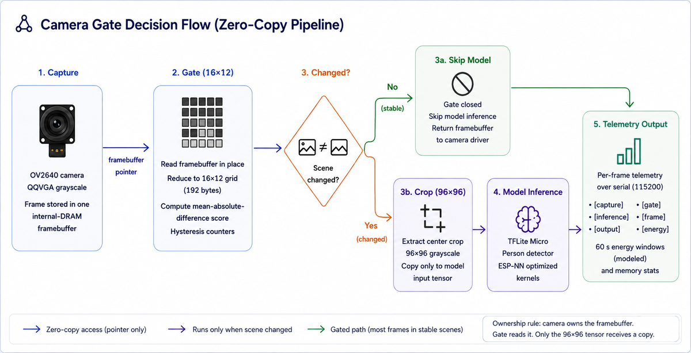

# Zero-Copy Camera Inference

Zero-Copy Camera Inference is an ESP32-S3 / ESP-IDF project for reducing edge-AI
energy use by avoiding unnecessary vision-model invocations.

It is centered on a small frame-difference gate that reads the live camera
framebuffer in place, reduces the image to a 16 x 12 grayscale grid, and decides
whether the person-detection model needs to run for the current frame.

The project is not trying to make a larger model or a more complex detector. It
shows a practical embedded pattern: keep the expensive AI path idle when the
scene is stable, then spend the model only when new information arrives.

## What it provides

- **Zero-copy camera gate** over the `esp-camera` framebuffer
- **Small reference representation** using a 192-byte grayscale grid
- **Hysteresis-based scene-change detection** to avoid noisy gate chatter
- **Adaptive reference refresh** for slow lighting drift and settled scene changes
- **ESP-IDF TFLite Micro inference** using Espressif's optimized component stack
- **Named proof builds** for gated and always-on comparison runs
- **Stage telemetry** for capture, gate, inference, serial output, memory, and energy windows
- **Host-side tests** for the gate, proof-mode selection, scheduler flags, and energy math

## Measured results

The final proof compares a gated build against an always-on build over a stable
60-second scene. Both builds use the same camera mode, model, serial telemetry,
and 500 ms frame schedule.

| Measurement | Result |
| --- | ---: |
| Arduino `Invoke()` average | 4.125 s |
| ESP-IDF / ESP-NN `Invoke()` average | 0.379 s |
| ESP-IDF / ESP-NN invoke speedup | 10.9x |
| Gate cost on stable frames | 0.955-0.980 ms |
| Stable-scene frames processed | 121 |
| Gated skipped inferences | 116 |
| Gated skip rate | 95% |
| Gated inference time in 60 s | 1.925 s |
| Always-on inference time in 60 s | 45.714 s |
| Gated busy time in 60 s | 4.507 s |
| Always-on busy time in 60 s | 48.381 s |
| Net compute saved by the gate | 43.877 s |
| Gated modeled energy | 10,834 mJ |
| Always-on modeled energy | 20,307 mJ |
| Modeled energy reduction | 46.6% |
| Peak heap / PSRAM used after model allocation | 163,844 B / 163,844 B |

The energy values are firmware-side estimates from measured stage timing and
board-profile current constants. They are useful for comparing gated versus
always-on duty cycle. They are not calibrated battery-energy measurements.

## How it works

The firmware captures QQVGA grayscale frames from the OV2640 camera into one
internal-DRAM framebuffer. The gate does not copy that frame. `src/main.cpp`
wraps the camera buffer as a `zcci::GrayscaleFrameView`, and `src/gate.cpp`
reduces it to a fixed 16 x 12 grid.

The gate compares the current grid against the stored reference grid with an
integer mean-absolute-difference score. A trigger threshold, clear threshold,
and frame-count hysteresis decide whether the scene is currently changed or
stable.

When the gate stays closed, the model path is skipped and the framebuffer is
returned to the camera driver. When the gate opens, the firmware copies only a
bounded 96 x 96 crop into the TFLite Micro input tensor and runs the person
detector.



The ownership rule is the important part: the camera owns the framebuffer, the
gate reads it, and only the model input tensor receives a copy. That keeps the
normal stable-scene path short and bounded.

## Firmware layout

- `src/main.cpp` - ESP-IDF application, camera setup, framebuffer lifetime,
  model input preparation, telemetry
- `src/gate.h`, `src/gate.cpp` - hardware-independent gate, reduced reference
  grid, hysteresis, adaptive reference policy
- `src/energy_estimator.h`, `src/energy_estimator.cpp` - 60-second modeled
  energy windows
- `src/comparison_mode.h` - compile-time gated versus always-on proof mode
- `src/frame_schedule.h` - compile-time frame schedule policy
- `src/person_detect_model_data.cpp` - bundled TensorFlow Lite Micro person
  detector converted to a C array
- `test/` - host tests for the portable logic

## Supported target

- **Board:** Seeed Studio XIAO ESP32S3 Sense class board
- **MCU:** ESP32-S3 at 240 MHz
- **Camera:** OV2640
- **Framework:** ESP-IDF through PlatformIO
- **Camera mode:** QQVGA 160 x 120 grayscale
- **Framebuffer:** one internal-DRAM camera framebuffer
- **Tensor arena:** 160 KiB, PSRAM preferred with DRAM fallback

The project uses `espressif/esp-tflite-micro` 1.3.5 and `esp32-camera` 2.1.6
through `src/idf_component.yml`. Downloaded managed components are intentionally
not committed.

## Build

Build the normal gated firmware:

```bash
pio run -e seeed_xiao_esp32s3_gated
```

Build the always-on comparison firmware:

```bash
pio run -e seeed_xiao_esp32s3_always_on
```

`seeed_xiao_esp32s3` is kept as a compatibility alias for the gated build.

## Flash and monitor

Flash the gated build:

```bash
pio run -e seeed_xiao_esp32s3_gated -t upload --upload-port <serial-port>
```

Open the serial monitor:

```bash
pio device monitor -p <serial-port> -b 115200
```

The proof builds print their selected comparison mode and frame schedule at
boot, so a captured log can show whether it came from the gated or always-on
firmware.

## Tests

Run the host gate tests:

```bash
mkdir -p .pio/host-tests
g++ -std=c++17 -Wall -Wextra -Werror -Isrc test/test_gate_logic.cpp src/gate.cpp -o .pio/host-tests/test_gate_logic
.pio/host-tests/test_gate_logic
```

Run the proof-mode tests:

```bash
mkdir -p .pio/host-tests
g++ -std=c++17 -Wall -Wextra -Werror -Isrc -DZCCI_COMPARISON_MODE_GATED_BUILD=1 test/test_comparison_mode.cpp -o .pio/host-tests/test_comparison_mode_gated
.pio/host-tests/test_comparison_mode_gated
g++ -std=c++17 -Wall -Wextra -Werror -Isrc -DZCCI_COMPARISON_MODE_ALWAYS_ON_BUILD=1 test/test_comparison_mode.cpp -o .pio/host-tests/test_comparison_mode_always_on
.pio/host-tests/test_comparison_mode_always_on
```

Run the energy and scheduler tests:

```bash
mkdir -p .pio/host-tests
g++ -std=c++17 -Wall -Wextra -Werror -Isrc test/test_energy_estimator.cpp src/energy_estimator.cpp -o .pio/host-tests/test_energy_estimator
.pio/host-tests/test_energy_estimator
g++ -std=c++17 -Wall -Wextra -Werror -Isrc -DZCCI_FRAME_SCHEDULE_DELAY_UNTIL_BUILD=1 test/test_frame_schedule.cpp -o .pio/host-tests/test_frame_schedule_delay_until
.pio/host-tests/test_frame_schedule_delay_until
g++ -std=c++17 -Wall -Wextra -Werror -Isrc -DZCCI_FRAME_SCHEDULE_DISABLED_BUILD=1 test/test_frame_schedule.cpp -o .pio/host-tests/test_frame_schedule_disabled
.pio/host-tests/test_frame_schedule_disabled
```

Build both firmware proof modes:

```bash
pio run -e seeed_xiao_esp32s3_gated
pio run -e seeed_xiao_esp32s3_always_on
```

## Telemetry

The firmware reports each stage of the pipeline:

- `[capture]` camera fetch latency, frame format, dimensions, and buffer pointer
- `[gate]` score, hysteresis counters, reference age, and reference update reason
- `[inference]` model preprocess and invoke time when the model path runs
- `[frame]` per-frame mode, decision, timing, skipped count, forced count, and peak memory
- `[output]` serial reporting cost and current heap/PSRAM headroom
- `[energy]` 60-second window totals for busy time, idle estimate, avoided inference, and modeled energy

## License

See `LICENSE` and `THIRD_PARTY_NOTICES.md`.
